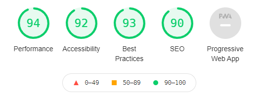
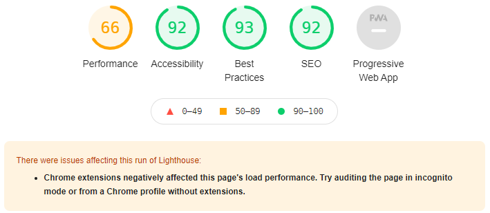
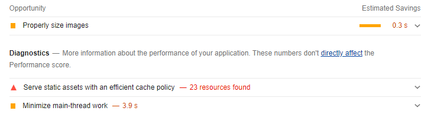
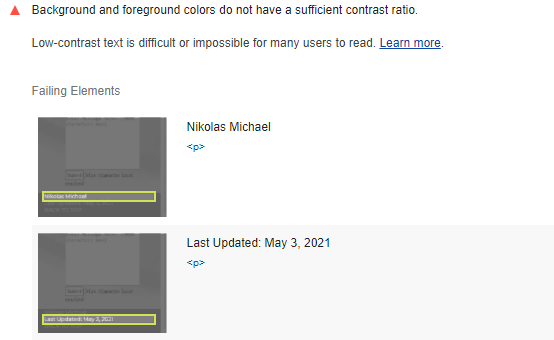

# Nikolas Michael's Profile

<b>IMPORTANT: All code has been minified to improve performance. If you would like to see the code cleanly, it's in the Source-code folder</b>

This website took about a month, on and off work to do. It uses vanilla HTML, CSS and JS. No libraries, plugins or frameworks. There are still other parts that
I would like to add to the website, for example: a rating component, filtering by tags in the project section, implementing HTTPBin for the contact section, a download 
link for the resume section and PHP for the footer section to name a few.
 
<h2><b>Desktop Lighthouse Report</b></h2>

Lighthouse report is as expected, as said before, all CSS and JS files have been minified to improve performance. This reduced the sizes of the files by about 25%.
Though as we will see, these problems can be exacerbated on mobile with it's limited data and memory.
 
<h2><b>Mobile Lighthouse Report</b></h2>

Performance in mobile will almost always be lower than desktop but making your code more efficient will make your website run more smoothly. For example, I have not 
incorporated async JS into this project as I believe it's not worth it given the JS is less than 100 lines long. As well, this test was done NOT using incognito mode.
The performance score goes up in incognito because the browser isn't expected to cache any assets.

  
 
One thing I have not yet done is properly size the menu icon so that sizing isn't needed in the css. As said, the test was done on a public browser (not incognito)
so the browser lowered the perfomance score because it was not able to cache any assets. This may be an issue with hosting on github. I will have to see if I can 
implement htaccess so that the images can be cache to improve performance. However this is not a big deal as the images used are relatively small.

  
 
Lighthouse isn't perfect, it had an issue with the contrast ratio of the footer. Though, lighthouse has various issues with black and white text placed on colourful
backgrounds. I think the contrast is okay, changing the colour of the text or footer to something different I believe would ruin the aesthetic of the page.
